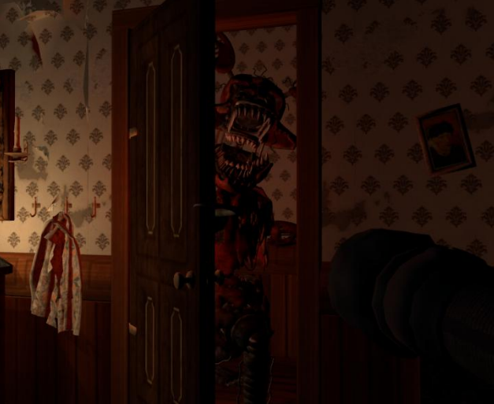
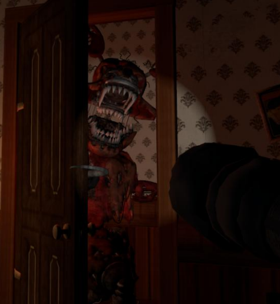

<h1 align="center">👁️ They're Watching</h1>

  <strong>A FNAF-Inspired Survival Horror Experience</strong> 
  Built with Modern OpenGL 4.1, C++, and GLSL Shaders

  <strong>Computer Graphics Project - Reti Antonio (30232)</strong>

  
  
  
  

---

<h3>📖 Theme & Story</h3>

  <b>They're Watching</b> is a survival horror experience heavily inspired by the Five Nights at Freddy's franchise. You play as a child trapped in a claustrophobic, dimly-lit bathroom, armed only with a flashlight against two relentless nightmare animatronics: <b>Nightmare Foxy</b> and <b>Nightmare Bonnie</b>. The gameplay revolves around time management and situational awareness—use light strategically to repel the monsters before they reach you.

  
  
   
  <em>Left: Foxy attacking. | Right: scare him away with your flashlight.</em>

  <i>"Listen carefully. Keep the light steady. They're watching."</i>

---

<h3>🎮 Gameplay Mechanics</h3>

<ul>
  <li><b>Light-Based Defense System:</b> Your flashlight is your only weapon. Shine it on the animatronics to build up their "light irritation" level until they retreat.</li>
  <li><b>Dual-Threat AI:</b>
    <ul>
      <li><b>Nightmare Foxy (The Door):</b> Appears randomly at the bathroom door with a loud creaky sound. He's quick to irritate—shine your light fast before he attacks.</li>
      <li><b>Nightmare Bonnie (The Window):</b> Scrapes against the glass to announce his arrival. He's stubborn and requires prolonged exposure to light before retreating.</li>
    </ul>
  </li>
  <li><b>Camera Management:</b> Smooth transitions between three camera positions (Spawn, Door, Window) simulate player movement as you monitor different entry points.</li>
  <li><b>Dynamic Flashlight:</b> Flickering intensifies based on the animatronic's irritation level, creating escalating tension.</li>
  <li><b>Audio Cues:</b> Spatial 3D sound alerts you when enemies arrive, become irritated, or retreat—your ears are as important as your eyes.</li>
</ul>

---

<h3>🏗️ Technical Implementation</h3>

<h4>Advanced Graphics Pipeline</h4>

<b>🎨 Blinn-Phong Lighting Model</b>
<ul>
  <li><b>Ambient:</b> Minimal constant light (≈0.01) to maintain horror atmosphere while preventing pitch-black areas</li>
  <li><b>Diffuse:</b> Dot product-based light scattering for realistic surface illumination</li>
  <li><b>Specular:</b> Halfway vector calculations create sharp highlights on reflective surfaces</li>
</ul>

<b>💡 Multi-Light Rendering System</b>
<ul>
  <li><b>Directional Light (Moonlight):</b> Parallel rays with faint blue tint for ambient scene lighting</li>
  <li><b>Point Lights:</b>
    <ul>
      <li>Three static candles on the vanity with warm orange glow</li>
      <li>Two thematic rim lights (red and blue) that accentuate the animatronics' silhouettes for dramatic horror cinematography</li>
      <li>Distance-based attenuation (constant, linear, quadratic)</li>
    </ul>
  </li>
  <li><b>Spotlight (Flashlight):</b> Camera-attached light with dual-cone system (inner/outer cutoff) for soft-edged illumination and dynamic flickering</li>
</ul>

<b>🌑 Shadow Mapping with Texture Arrays</b>

  Instead of traditional 2D shadow maps, this project implements a <b>GL_TEXTURE_2D_ARRAY</b> system storing depth information for <b>five light sources</b> in a single 4096×4096 texture unit:

<ul>
  <li><b>Layer 0:</b> Directional moonlight</li>
  <li><b>Layer 1:</b> Flashlight (spotlight)</li>
  <li><b>Layers 2-4:</b> Individual candles (point lights), each oriented differently for cubemap-like coverage with high performance</li>
</ul>

  <b>Rendering Process:</b>
  <ul>
    <li><b>Depth Pass:</b> Scene rendered five times, each pass binding a different layer via <code>glFramebufferTextureLayer()</code></li>
    <li><b>Shader Sampling:</b> Fragment shader retrieves depth using <code>texture(shadowMapArray, vec3(projCoords.xy, layerIndex))</code></li>
    <li><b>Result:</b> Unified shadow system with minimal memory overhead and efficient GPU utilization</li>
  </ul>

<b>🎥 Smooth Camera Transitions</b>

  Camera movement uses <code>glm::mix(start, end, t)</code> with <b>smoothstep easing</b> for natural, cinematic transitions:
   
  <code>t = t * t * (3.0f - 2.0f * t)</code>

<b>🎯 MVP Pipeline</b>
<ul>
  <li><b>Model Matrix:</b> Handles animatronic positions and door animations</li>
  <li><b>View Matrix:</b> Derived from custom <code>gps::Camera</code> class using Euler angles (Pitch/Yaw)</li>
  <li><b>Projection Matrix:</b> Perspective projection for 3D depth perception</li>
</ul>

---

<h3>🧠 AI & Game Logic</h3>

<b>Light Irritation System:</b>

  The core mechanic is stored in a central AI structure:

<ul>
  <li><b>lightIrritation:</b> Float value that increases when flashlight is active and correctly aligned (alignment > 0.9) with the animatronic</li>
  <li><b>irritationThreshold:</b> Once exceeded, the animatronic is forced to retreat</li>
  <li><b>Personality Differences:</b> Foxy irritates quickly (aggressive), Bonnie requires prolonged exposure (stubborn)</li>
</ul>

<b>Random Appearance System:</b>
<ul>
  <li>Animatronics appear at randomized intervals</li>
  <li>Audio cues signal their arrival at entry points</li>
  <li>Player must react quickly and manage camera positions efficiently</li>
</ul>

---

<h3>🛠️ Architecture & Class Hierarchy</h3>

<table>
  <tr>
    <td><b>gps::Window</b></td>
    <td>GLFW/GLEW wrapper managing OpenGL context and input polling</td>
  </tr>
  <tr>
    <td><b>gps::Shader</b></td>
    <td>Loads, compiles, and links GLSL programs; manages uniform data transmission</td>
  </tr>
  <tr>
    <td><b>gps::Model3D</b></td>
    <td>High-level 3D asset container using <code>tiny_obj_loader</code> to parse .obj files</td>
  </tr>
  <tr>
    <td><b>gps::Mesh</b></td>
    <td>Low-level geometry class handling VAOs, VBOs, and EBOs for GPU vertex data</td>
  </tr>
  <tr>
    <td><b>gps::Camera</b></td>
    <td>View matrix logic with orientation vectors (Front, Right, Up) from Euler angles</td>
  </tr>
  <tr>
    <td><b>tiny_obj_loader</b></td>
    <td>Header-only library for parsing .obj/.mtl geometric data</td>
  </tr>
  <tr>
    <td><b>stb_image</b></td>
    <td>Image decoder for texture loading (JPG, PNG)</td>
  </tr>
  <tr>
    <td><b>SFML Audio</b></td>
    <td>2D and 3D positional audio for immersive sound cues</td>
  </tr>
</table>

<b>Shader Pipeline:</b>
<ul>
  <li><b>basic.vert / basic.frag:</b> Main rendering pipeline implementing Blinn-Phong model and shadow sampling from texture array</li>
  <li><b>depthMap.vert / depthMap.frag:</b> Lightweight shadow pass pipeline recording scene depth from each light's perspective</li>
</ul>

---

<h3>🎮 Controls</h3>

<table>
  <tr>
    <th>Key</th>
    <th>Action</th>
  </tr>
  <tr>
    <td><b>W/A/S/D</b></td>
    <td>Camera movement</td>
  </tr>
  <tr>
    <td><b>Mouse</b></td>
    <td>Look around (FPS-style)</td>
  </tr>
  <tr>
    <td><b>1</b></td>
    <td>Spawn position</td>
  </tr>
  <tr>
    <td><b>2</b></td>
    <td>Look at Door (Foxy)</td>
  </tr>
  <tr>
    <td><b>3</b></td>
    <td>Look at Window (Bonnie)</td>
  </tr>
  <tr>
    <td><b>F</b></td>
    <td>Toggle flashlight</td>
  </tr>
  <tr>
    <td><b>J</b></td>
    <td>Solid/Smooth rendering (default)</td>
  </tr>
  <tr>
    <td><b>K</b></td>
    <td>Wireframe mode</td>
  </tr>
  <tr>
    <td><b>L</b></td>
    <td>Point rendering mode</td>
  </tr>
  <tr>
    <td><b>ESC</b></td>
    <td>Exit game</td>
  </tr>
</table>

<b>🎯 Survival Guide:</b>
<ul>
  <li><b>Foxy (Door):</b> Creaky door sound => press '2', shine light until door slams shut</li>
  <li><b>Bonnie (Window):</b> Scraping glass sound => check window with '3'. Requires persistent light exposure</li>
</ul>

---

<h3>🔧 Dependencies</h3>

- **OpenGL 4.1+** (Core Profile)
- **GLFW 3.x** - Window management
- **GLEW** - OpenGL extension loading
- **GLM** - Mathematics library
- **tiny_obj_loader** - OBJ file parsing
- **stb_image** - Texture loading
- **SFML** - 2D/3D positional audio

---

<h3>🚀 Future Development</h3>

 In this section, I would like to say that working on this project was a breath of fresh air,
because I could choose my own theme and do something creative built around it. For future updates:

<ul>
  <li><b>Full Gamification:</b> Jump scares, game over screens, main menu</li>
  <li><b>Battery Mechanic:</b> Limited flashlight power requiring strategic usage</li>
  <li><b>Additional Enemies:</b> More animatronics with unique behaviors</li>
  <li><b>Multiple Nights:</b> Progressive difficulty levels with escalating AI aggression</li>
  <li><b>Persistence System:</b> Save/load functionality for progression tracking</li>
</ul>

---

  <b>Student:</b> Reti Antonio (30232) 
  <b>Course:</b> Computer Graphics (GP) 
  <b>Institution:</b> Technical University of Cluj-Napoca

---

  <i>Created with passion for graphics programming and horror games 👁️🕯️</i> 
  All FNAF-related concepts are property of Scott Cawthon and Steel Wool Studios

